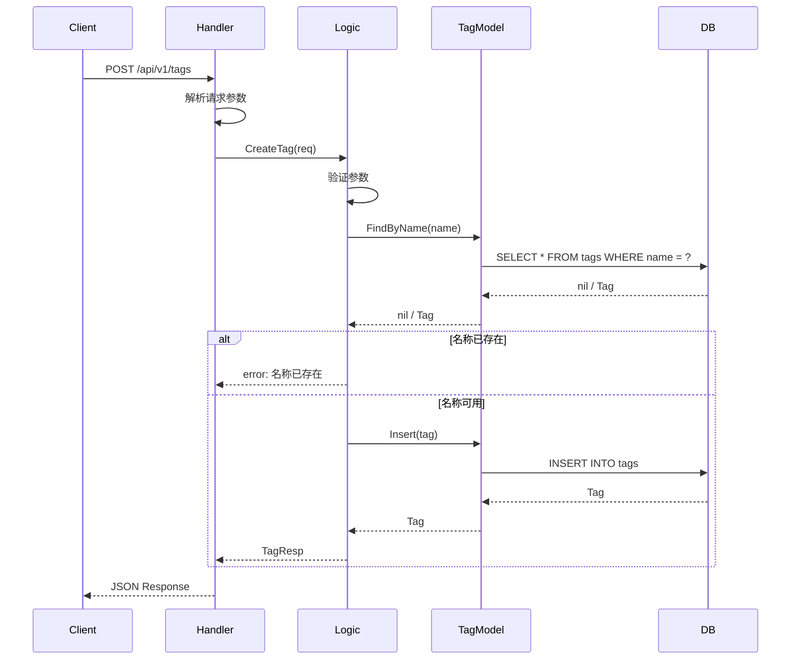

# Design: Data Tag Management

## Architecture Overview

数据标签管理功能遵循IDRM四层架构：

```
Handler Layer (api/internal/handler/tag_management/)
    ↓
Logic Layer (api/internal/logic/tag_management/)
    ↓
Model Layer (model/tag_management/)
    ↓
Database (MySQL)
```

## ORM Strategy

**选择 GORM** 作为主要ORM，原因：
1. 标签与数据资源是多对多关系，GORM的关联处理更方便
2. 需要复杂的查询（按标签筛选、统计等），GORM表达更清晰
3. 事务处理涉及多个表，GORM的事务管理更完善

## File Structure

```
api/
├── internal/
│   ├── handler/
│   │   └── tag_management/
│   │       ├── createtaghandler.go       # 创建标签
│   │       ├── gettaghandler.go          # 获取标签详情
│   │       ├── listtagshandler.go        # 标签列表
│   │       ├── updatetaghandler.go       # 更新标签
│   │       ├── deletetaghandler.go       # 删除标签
│   │       ├── assigntagshandler.go      # 为数据打标签
│   │       ├── unassigntagshandler.go    # 移除标签
│   │       └── searchbytagshandler.go    # 按标签搜索
│   ├── logic/
│   │   └── tag_management/
│   │       ├── createtaglogic.go
│   │       ├── gettaglogic.go
│   │       ├── listtagslogic.go
│   │       ├── updatetaglogic.go
│   │       ├── deletetaglogic.go
│   │       ├── assigntagslogic.go
│   │       ├── unassigntagslogic.go
│   │       └── searchbytagslogic.go
│   ├── types/
│   │   └── tag_management_types.go       # Request/Response类型定义
│   └── svc/
│       └── servicecontext.go             # 添加TagModel
│
model/
└── tag_management/
    ├── tag/
    │   ├── interface.go                  # TagModel接口
    │   ├── types.go                      # Tag结构体
    │   ├── vars.go                       # 常量和错误定义
    │   ├── factory.go                    # GORM工厂
    │   └── gorm_dao.go                   # GORM实现
    └── resource_tag/
        ├── interface.go                  # ResourceTagModel接口
        ├── types.go                      # ResourceTag关联结构体
        ├── vars.go
        ├── factory.go
        └── gorm_dao.go
```

## Interface Definitions

```go
// model/tag_management/tag/interface.go
package tag

import "context"

type TagModel interface {
    // 基础CRUD
    Insert(ctx context.Context, data *Tag) (*Tag, error)
    FindOne(ctx context.Context, id int64) (*Tag, error)
    Update(ctx context.Context, data *Tag) error
    Delete(ctx context.Context, id int64) error

    // 查询方法
    FindByName(ctx context.Context, name string) (*Tag, error)
    FindAll(ctx context.Context) ([]*Tag, error)
    List(ctx context.Context, page, pageSize int) ([]*Tag, int64, error)
    Search(ctx context.Context, keyword string, page, pageSize int) ([]*Tag, int64, error)

    // 状态管理
    UpdateStatus(ctx context.Context, id int64, status int) error

    // 事务支持
    WithTx(tx interface{}) TagModel
    Trans(ctx context.Context, fn func(ctx context.Context, model TagModel) error) error
}

// model/tag_management/resource_tag/interface.go
package resource_tag

import "context"

type ResourceTagModel interface {
    // 关联管理
    Assign(ctx context.Context, resourceID int64, resourceType string, tagID int64) error
    Unassign(ctx context.Context, resourceID int64, resourceType string, tagID int64) error
    GetResourceTags(ctx context.Context, resourceID int64, resourceType string) ([]int64, error)

    // 批量操作
    BatchAssign(ctx context.Context, resourceID int64, resourceType string, tagIDs []int64) error
    BatchUnassign(ctx context.Context, resourceID int64, resourceType string, tagIDs []int64) error
    ReplaceTags(ctx context.Context, resourceID int64, resourceType string, tagIDs []int64) error

    // 查询方法
    FindByResource(ctx context.Context, resourceID int64, resourceType string) ([]*ResourceTag, error)
    FindByTag(ctx context.Context, tagID int64) ([]*ResourceTag, error)
    FindByTags(ctx context.Context, tagIDs []int64, resourceType string) ([]int64, error)

    // 统计
    CountByTag(ctx context.Context, tagID int64) (int64, error)

    // 事务支持
    WithTx(tx interface{}) ResourceTagModel
    Trans(ctx context.Context, fn func(ctx context.Context, model ResourceTagModel) error) error
}
```

## Sequence Diagrams

### 创建标签流程



## Data Model

### Table Schema

```sql
-- 标签表
CREATE TABLE `tags` (
    `id` BIGINT UNSIGNED NOT NULL AUTO_INCREMENT COMMENT '标签ID',
    `name` VARCHAR(50) NOT NULL COMMENT '标签名称',
    `description` VARCHAR(200) DEFAULT NULL COMMENT '标签描述',
    `color` VARCHAR(7) DEFAULT '#1890ff' COMMENT '标签颜色',
    `status` TINYINT NOT NULL DEFAULT 1 COMMENT '状态：0-禁用，1-启用',
    `created_by` BIGINT UNSIGNED NOT NULL COMMENT '创建人ID',
    `updated_by` BIGINT UNSIGNED DEFAULT NULL COMMENT '更新人ID',
    `created_at` DATETIME NOT NULL DEFAULT CURRENT_TIMESTAMP COMMENT '创建时间',
    `updated_at` DATETIME NOT NULL DEFAULT CURRENT_TIMESTAMP ON UPDATE CURRENT_TIMESTAMP COMMENT '更新时间',
    PRIMARY KEY (`id`),
    UNIQUE KEY `uk_name` (`name`),
    KEY `idx_status` (`status`),
    KEY `idx_created_at` (`created_at`)
) ENGINE=InnoDB DEFAULT CHARSET=utf8mb4 COMMENT='数据标签表';

-- 资源标签关联表
CREATE TABLE `resource_tags` (
    `id` BIGINT UNSIGNED NOT NULL AUTO_INCREMENT COMMENT '关联ID',
    `resource_id` BIGINT UNSIGNED NOT NULL COMMENT '资源ID',
    `resource_type` VARCHAR(50) NOT NULL COMMENT '资源类型',
    `tag_id` BIGINT UNSIGNED NOT NULL COMMENT '标签ID',
    `created_at` DATETIME NOT NULL DEFAULT CURRENT_TIMESTAMP COMMENT '创建时间',
    PRIMARY KEY (`id`),
    UNIQUE KEY `uk_resource_tag` (`resource_id`, `resource_type`, `tag_id`),
    KEY `idx_tag_id` (`tag_id`),
    KEY `idx_resource` (`resource_id`, `resource_type`)
) ENGINE=InnoDB DEFAULT CHARSET=utf8mb4 COMMENT='资源标签关联表';
```

### Go Structs

```go
// model/tag_management/tag/types.go
package tag

import "time"

type Tag struct {
    Id          int64     `json:"id" gorm:"column:id;primaryKey"`
    Name        string    `json:"name" gorm:"column:name;type:varchar(50);not null"`
    Description string    `json:"description" gorm:"column:description;type:varchar(200)"`
    Color       string    `json:"color" gorm:"column:color;type:varchar(7);default:'#1890ff'"`
    Status      int       `json:"status" gorm:"column:status;type:tinyint;not null;default:1"`
    CreatedBy   int64     `json:"createdBy" gorm:"column:created_by;not null"`
    UpdatedBy   *int64    `json:"updatedBy" gorm:"column:updated_by"`
    CreatedAt   time.Time `json:"createdAt" gorm:"column:created_at;autoCreateTime"`
    UpdatedAt   time.Time `json:"updatedAt" gorm:"column:updated_at;autoUpdateTime"`
}

// TableName 指定表名
func (Tag) TableName() string {
    return "tags"
}

// model/tag_management/resource_tag/types.go
package resource_tag

import "time"

type ResourceTag struct {
    Id           int64     `json:"id" gorm:"column:id;primaryKey"`
    ResourceId   int64     `json:"resourceId" gorm:"column:resource_id;not null"`
    ResourceType string    `json:"resourceType" gorm:"column:resource_type;type:varchar(50);not null"`
    TagId        int64     `json:"tagId" gorm:"column:tag_id;not null"`
    CreatedAt    time.Time `json:"createdAt" gorm:"column:created_at;autoCreateTime"`
}

// TableName 指定表名
func (ResourceTag) TableName() string {
    return "resource_tags"
}
```

## Error Handling

### 错误码定义

```go
// pkg/errorx/tag_errors.go
package errorx

const (
    // 标签相关错误 (31000-31999)
    ErrTagNotFound           = 31001 // 标签不存在
    ErrTagAlreadyExists      = 31002 // 标签名称已存在
    ErrTagNameInvalid        = 31003 // 标签名称格式错误
    ErrTagInUse              = 31004 // 标签正在使用中
    ErrTagStatusInvalid      = 31005 // 标签状态无效

    // 标签关联错误 (32000-32999)
    ErrResourceTagExists     = 32001 // 关联已存在
    ErrResourceTagNotFound   = 32002 // 关联不存在
    ErrResourceTagInvalid    = 32003 // 无效的关联
)
```

## Testing Strategy

### 单元测试

**Handler层测试**：
- Mock Logic层
- 测试请求解析
- 测试响应格式化

**Logic层测试**：
- Mock Model层
- 测试业务规则验证
- 测试异常处理
- 测试数据转换

**Model层测试**：
- 使用test database
- 测试CRUD操作
- 测试事务处理
- 测试复杂查询

## Technical Constraints

### IDRM General Constraints
- MUST遵循分层架构 (Handler → Logic → Model)
- MUST使用GORM实现
- 函数MUST < 50行
- MUST使用中文注释
- Error wrapping MUST使用 %w
- 测试覆盖率MUST > 80%

### Feature Specific Constraints

#### 性能约束
- 标签列表查询响应时间 < 100ms
- 按标签搜索数据响应时间 < 200ms
- 支持单个资源关联最多100个标签

#### 安全约束
- 标签名称防SQL注入
- 标签名称防XSS
- 权限校验：只有管理员可以CRUD标签
- 防止批量操作滥用（单次最多50个标签）

## API Contract (go-zero)
见 `tag_management.api` 文件
